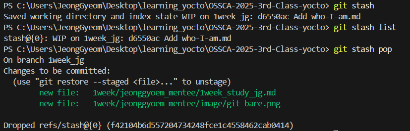

# 1주차 학습 내용

## 목표
 - 소개하기
 - git 명령어를 사용해 본 내용을 올리기
 - git init과 git init --bare로 만든 directory의 차이점을 설명으로 올리기
 - stash 명령어를 사용해 보고 왜, 언제 필요할지 설명으로 올리기

---

## 0. 자기 소개
 - **이름** : 최정겸
 - **Yocto 수업을 듣는 이유:**
    1. 오픈소스 생태계를 체험하고 이해하고 싶어서 입니다. 
    2. 여러 대기업들이 Yocto를 사용한다고 들었는데, 어떤 식으로 사용하는지 궁금해서 입니다.

---

## 1. git 명령어 실습
- git init
- git add . 
- git commit -m "first week"
- git status
- git branch -d branch_name : 브랜치 삭제
- git checkout -b branch_name : 브랜치 생성 및 이동
- git checkout branch_name : 브랜치 이동
- git push origin branch_name : 원격 저장소에 브랜치 푸시

---

2. git init과 git init --bare로 만든 directory의 차이점


- git bare 사용 예제

```bash
# Bare Repository 생성
$ mkdir project.git
$ cd project.git
$ git init --bare

# 작업 Repository 생성
$ cd ..
$ git clone project.git project
$ cd project
$ echo '#include <iostream>\nint main(){std::cout<<"Hello";}' > test.cpp
$ git add test.cpp
$ git commit -m "first commit"

# 작업 Repository에서 Bare Repository로 푸시
$ git push origin main

# 다른 작업 Repository에서 Bare Repository 클론
$ cd ..
$ git clone project.git another_project
$ cd another_project
$ cat test.cpp
```

- git bare 사용 이유
    - 중앙 저장소 역할을 하는 원격 저장소를 만들기 위해서 사용 (GPT SAY)
    - 사실 왜 사용하는지 잘 모르겠음. (git bare를 쓰더라도 충돌이 없는 것은 아님)

--- 

## 3. stash 명령어 사용해 보고 왜, 언제 필요할지 설명

 - **stash 명령어 예제:**



```bash
$ git stash
$ git stash list
$ git stash pop # 가장 최근 stash를 적용 및 제거
$ git stash apply "stash@{0}" # 특정 stash 적용, 윈도우 powershell에서는 "" 필요!!
```

 - **stash 명령어 사용 이유:**
    - 현재 작업 중인 내용을 임시로 저장 개념.
    - 다른 브랜치로 이동해야 할 때, 유용함.
    - 다만 stash를 사용하면, working directory가 깨끗해지기 때문에, 이어서 작업하려면 git apply를 사용해야 함. (POP은 적용 후 stash에서 제거 및 적용, APPLY는 적용만 함.)
    - 내가 짠 코드를 임시 저장하고 gpt에게 물어볼 때 유용할 것 같음.

