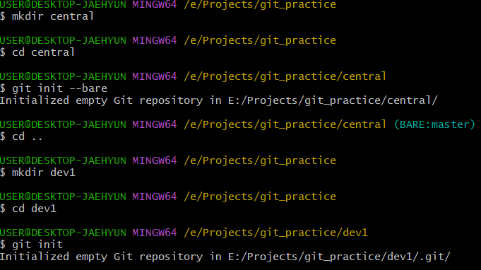
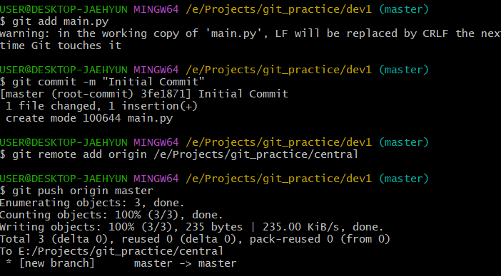
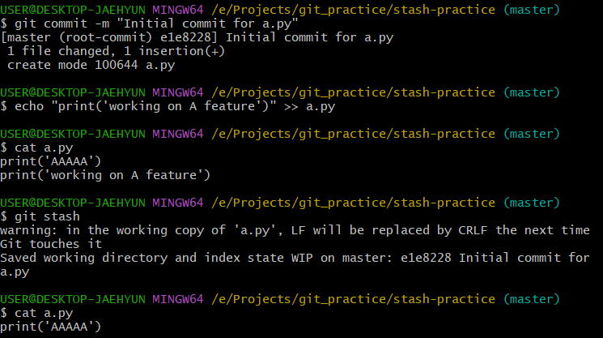
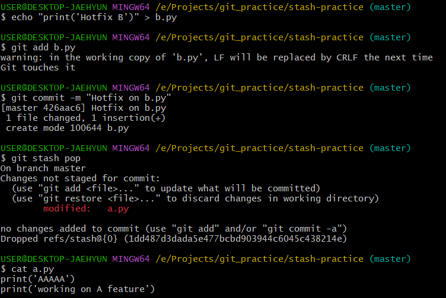

## 자기 소개
컴퓨터공학과 4학년에 재학 중이고 백엔드와 네트워크 분야에 관심이 많습니다. 평소 오픈소스 소프트웨어를 사용하는 데서 나아가, 실제 오픈소스 커뮤니티에 직접 기여하고 참여해보고 싶어 지원하게 되었습니다.

## git init
- 로컬에서 새로운 `git` 저장소를 생성할 때 사용하는 명령어입니다.
- `.git` 디렉토리가 생성되고 이 폴더는 `git`이 소스코드를 버전 관리할 수 있게 해줍니다.

## git init --bare
- 원격 저장소(중앙 저장소)를 만들 때 사용하는 명령어입니다.
- `working directory` 없이 `.git` 만 있는 구조로 만들어집니다.
- 여러 로컬 저장소가 이 중앙 저장소에 `push`/`pull`/`clone` 할 수 있도록 사용됩니다. 

- `central` 디렉토리에서 `git init --bare` 명령어를 실행하여 중앙 저장소를 생성한다. 이 저장소에는 `.git` 내용만 존재한다.
- `dev1` 디렉토리에서 `git init`으로 로컬 저장소를 만들고 커밋한 것을 등록한 위의 중앙 저장소에 `push`한다.

## git stash
- 현재 작업중인 것을 임시로 저장하고 `working directory`를 변경사항 없는 상태로 만들어서 다른 브랜치로 체크아웃하거나 먼저 급하게 버그 수정할 때 사용합니다.
- `stash pop`으로 다시 불러올 수 있고 충돌이 나면 수동으로 해결할 수 있습니다.

- `a.py`에서 코드 두번째 줄 추가하고 `git stash`로 현재 working directory 상태를 임시 저장한다.
- `a.py` 를 보면 원래 커밋된 "print('AAAAA')" 한 줄만 남아 정상적으로 stash 적용됨

- `b.py` 파일에서 작업 완료하고 `git stash pop`로 stash에 넣어둔 `a.py`의 변경사항을 복구한다.
- 다시 `a.py` 를 보면 코드 두번째 줄이 복구되어 있다.