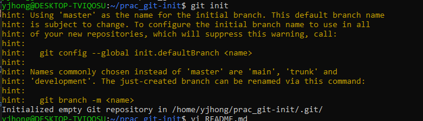
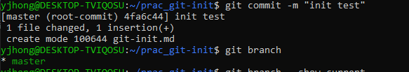
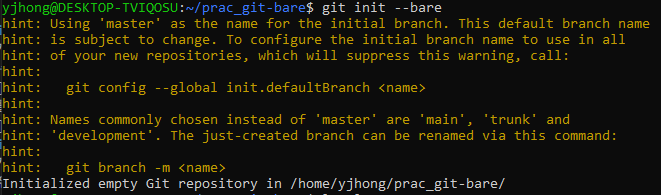
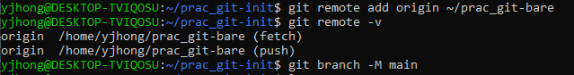
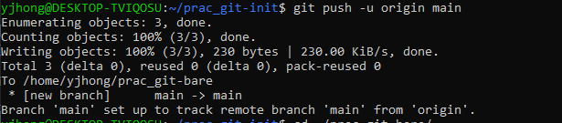
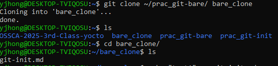
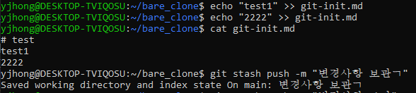
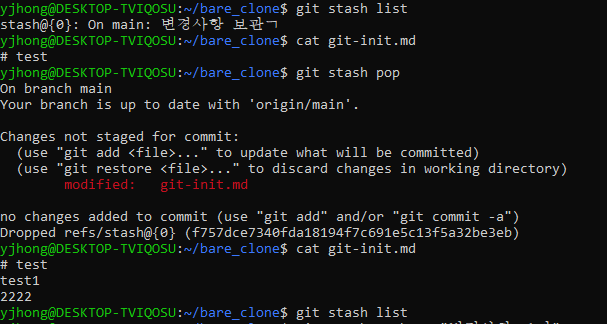

## 자기소개
로봇>임베디드>시스템sw/펌웨어 엔지니어로 취업 준비 중입니다.

최근 프로젝트에서 yocto로 빌드함과 리눅스를 공부하면서 배포, 협업 개발, 오픈소스에 대해 배우고자 참여하였습니다.  

git은 학과 팀플 중 add,commit,pull,push만 접해보고 이외엔 잘 모르지만, 이번 기회에 git 메커니즘과 협업 방법을 더 배우고 싶습니다.

### git init 
- 작업 트리가 있는 로컬 저장소가 생성되고, 파일을 직접 수정하고 커밋 가능하다. 

gitinit.md를 작성 후 커밋해보았다.

### git init --bare
- 작업 트리가 없는 저장소이다. 팀원이 push/pull하는 공유 저장소로 쓰일 수 있다. --bare와 다르게 git init은 로컬 개발용 저장소가 될 수 있다.

위에서 git-init.md를 편집/커밋했던 작업 디렉토리(prac_git-init)의 원격 저장소로 로컬 bare 저장소(prac_git-bare)를 등록해본다.
  

작업 트리에서 main 브랜치 커밋을 bare 저장소의 main 브랜치로 푸시해 새 브랜치가 생겼다.

bare 저장소는 작업 트리가 없어 파일이 직접 안보이고, clone해보면 확인할 수 있다.

### git stash
- 커밋 전 변경사항을 임시 보관하는 기능이다. 
중간에 다른 브랜치 전환 후 작업하다 돌아와서 커밋하는 경우나, 급하게 수정만 해놓는 경우에 사용한다.  
- stash push/apply/pop/list  
    git-init.md를 수정하고 stash push함.
    작업 트리에는 # test만(이전 커밋상태?)있고 stash로 수정사항은 숨겨져 있다.
    

    stash pop으로 변경 사항을 작업 트리에 적용했다. 동시에 stash list에서 삭제되고, apply는 삭제되지않고 복사하여 남겨놓는 기능이다.
    

